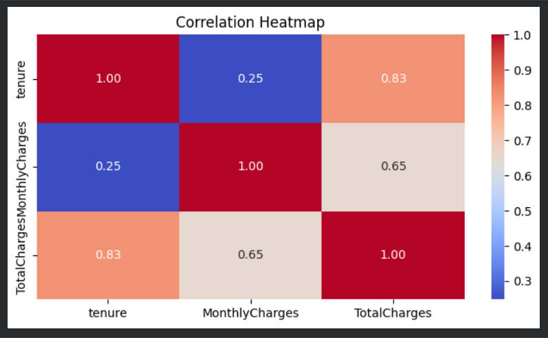
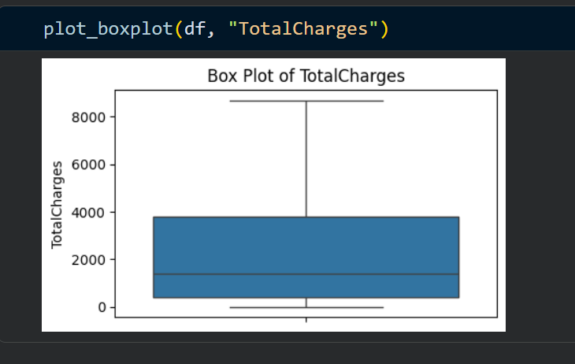
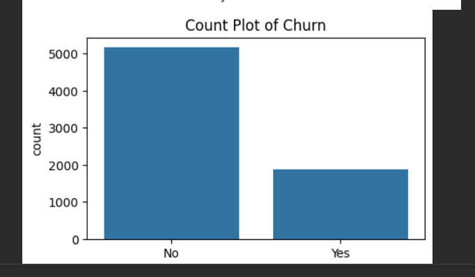

# Customer Churn Prediction Using Machine Learning

## Overview
This project predicts customer churn using Machine Learning techniques.  
Customer churn prediction helps businesses identify customers who are likely to leave a service.

The project includes:
- Data Cleaning
- Exploratory Data Analysis (EDA)
- Feature Encoding
- Handling Imbalanced Data using SMOTE
- Model Training & Evaluation
- Customer Churn Prediction System

---

## Technologies Used

- Python
- NumPy
- Pandas
- Matplotlib
- Seaborn
- Scikit-learn
- XGBoost
- Imbalanced-learn (SMOTE)

---

## Machine Learning Algorithms Used

- Decision Tree Classifier
- Random Forest Classifier
- XGBoost Classifier

---

## Project Workflow

### 1. Importing Dependencies
Imported all required Python libraries for:
- Data analysis
- Visualization
- Machine learning

### 2. Data Loading & Understanding
- Loaded customer churn dataset
- Checked dataset structure
- Explored missing values

### 3. Exploratory Data Analysis (EDA)
Performed:
- Box plots
- Count plots
- Correlation heatmap
- Numerical analysis

### 4. Data Preprocessing
- Label Encoding
- Train-test split
- SMOTE for class balancing

### 5. Model Training
Trained multiple machine learning models and compared their performance.

### 6. Model Evaluation
Evaluated using:
- Accuracy Score
- Confusion Matrix
- Classification Report

---

## Dataset
The dataset contains customer-related information used for churn prediction.

Features include:
- Customer demographics
- Payment details
- Service subscriptions
- Account information

---

## How to Run the Project

### Install Dependencies

```bash
pip install numpy pandas matplotlib seaborn scikit-learn xgboost imbalanced-learn
```

### Run Notebook

```bash
jupyter notebook
```

Open:
```text
Customer_Churn_Prediction_Using_ML.ipynb
```

---

## Results
- Successfully built a customer churn prediction model
- Random Forest achieved strong performance
- SMOTE improved handling of imbalanced data

## Project Screenshots

### Correlation Heatmap


### Box Plot Analysis


### Customer Churn Distribution


## Future Improvements
- Hyperparameter tuning
- Deploy using Flask or Streamlit
- Create interactive dashboard

---

## Author
Purva Harne

---

## License
This project is for educational purposes.
